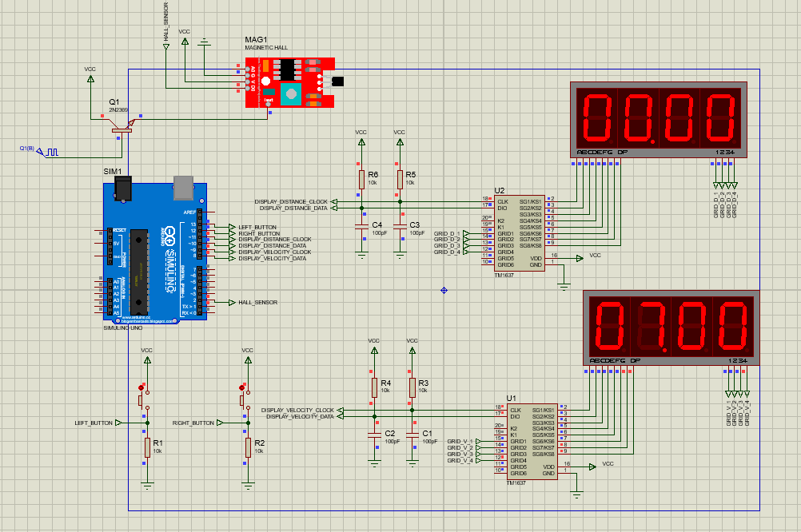
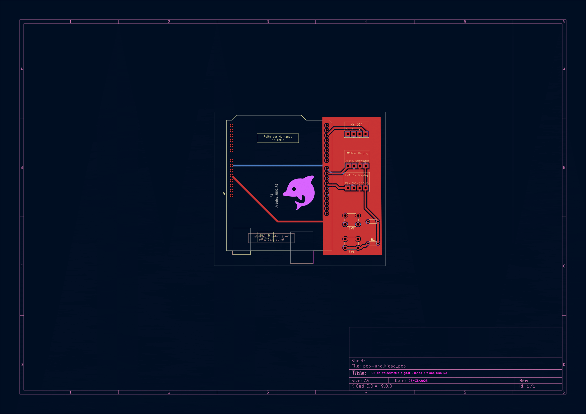

# Dolphin

Velocimetro Digital para a minha bicicleta. Não cheguei a construí-lo por falta de material. Mas, quem quiser tentar, sinta-se livre. =)

> Para simular, foi utilizado o [Proteus 8](https://www.labcenter.com/)

## Requisitos

- [X] Medir a velocidade em Km/h;
- [X] Medir a distância percorrida;
- [X] Reiniciar a medida da velocidade (em caso de parada);
- [X] Reiniciar a distância percorrida;
- [X] Configurar o raio via software

## Materiais

- [Arduino Uno R3](https://docs.arduino.cc/hardware/uno-rev3/) 
- [Módulo TM1637 com Display 7 Segmentos 4 Dígitos](https://www.makerhero.com/produto/modulo-tm1637-com-display-7-segmentos-4-digitos/?srsltid=AfmBOoqLNAwazzRplnsqXKzoM1co3EbmQKjKahlsOt5L4xRWT-XB6TJF)
- [Magnetic Hall Effect Sensor (KY-024)](https://www.eletrogate.com/sensor-de-efeito-hall-ky-024?srsltid=AfmBOorNmNga4v0U0b5LsnoG5FFOnN1BOWNrU9AB9Dpqz0ndBUFFKoLm)
- [Push Button](https://www.autocorerobotica.com.br/botao-de-toque-6x6mm)
- [Resistores 10K](https://www.autocorerobotica.com.br/resistor-de-precisao-10k-1-4w-1)

## Multifunções nos botões

- Caso o botão esquerdo for pressionado por pelo menos 1 segundos, o sistema entra em modo de configuração. Se pressionado novamente por 1 segundos, o estado é revertido;

- No modo de configuração, é possível configurar o raio da roda. Botão esquerdo aumenta ao valor e o direito decrementa o valor;

- Se o botão direito for pressionado sem estar no estado de configuração, o hodometro é resetado;

## Esquema Elétrico e PCB

> Para a produção dessas imagens, foi-se utilizado o software [KiCad](https://www.kicad.org/)

## Pessoalmente,

Eu gostei muito de descobrir o [PlatformIo](https://platformio.org/). Minhas sinceras felicidades para os mantenedores desse projeto. Além disso, desenvolver a implementação de um botão multifunções foi devidamente interessante. Claro, isso foi uma bela surpresa para mim. Percebi que uma abordagem orientada a eventos e a objetos foi uma descoberta no desenvolvimento desse projeto. 